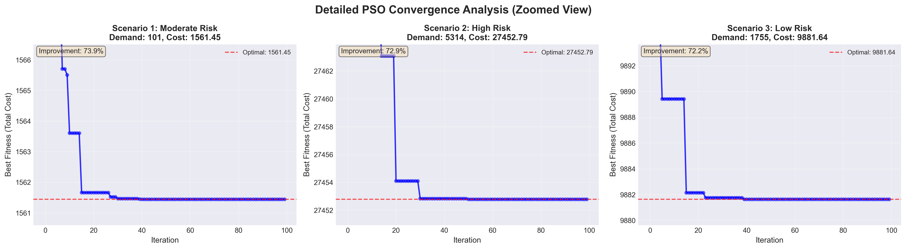
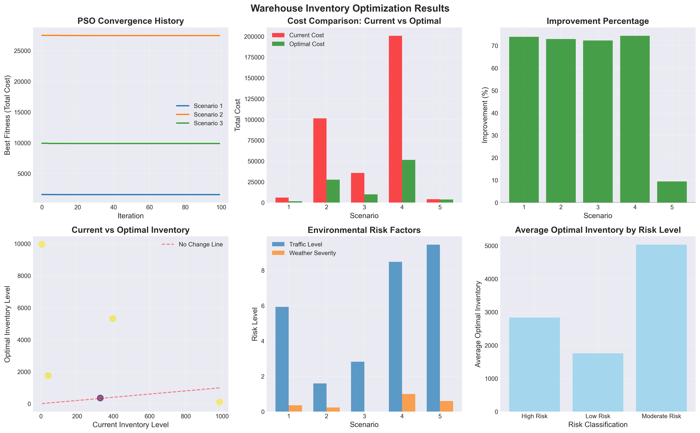

# 📦 Environmental-Aware Warehouse Inventory Optimization Using Particle Swarm Optimization (PSO)

[](https://www.python.org/)
[](https://en.wikipedia.org/wiki/Particle_swarm_optimization)
[]()

> **ISP611 Group Project**  
> An environmental-aware warehouse inventory optimization model that determines the optimal inventory level using Particle Swarm Optimization (PSO).

---

# 📖 Table of Contents

- [Overview](#-overview)
- [Problem Statement](#-problem-statement)
- [Project Objectives](#-project-objectives)
- [Key Features](#-key-features)
- [Optimization Model](#-optimization-model)
- [PSO Workflow](#-pso-workflow)
- [Dataset](#-dataset)
- [Installation](#-installation)
- [Usage](#-usage)
- [Results](#-results)
- [Project Structure](#-project-structure)
- [Limitations](#-limitations)
- [Future Improvements](#-future-improvements)
- [Acknowledgements](#-acknowledgements)

---

# 📌 Overview

This project develops an **Environmental-Aware Warehouse Inventory Optimization** model using **Particle Swarm Optimization (PSO)**.

The objective is to determine the **optimal inventory level** that minimizes the total inventory cost while considering both customer demand and environmental conditions.

Unlike traditional inventory optimization methods that focus only on demand and inventory costs, this project incorporates environmental factors including:

- 🚚 Traffic congestion
- 🌧 Weather condition severity
- 🚢 Port congestion

These factors are integrated into the optimization process through an environmental penalty, allowing the algorithm to produce more practical inventory recommendations.

---

# ❗ Problem Statement

Warehouse inventory management faces two common challenges:

- Excess inventory increases holding costs.
- Insufficient inventory results in stockout costs.

In real-world logistics, inventory decisions are also affected by external environmental conditions such as traffic congestion, severe weather, and port congestion, which may delay replenishment and disrupt supply chain operations.

This project addresses these challenges by applying **Particle Swarm Optimization (PSO)** to identify the inventory level that minimizes the overall inventory cost while considering environmental risks.

---

# 🎯 Project Objectives

- Determine the optimal warehouse inventory level using Particle Swarm Optimization (PSO).
- Minimize total inventory cost by balancing:
  - Holding Cost
  - Stockout Cost
  - Environmental Penalty
- Evaluate the optimization performance under different environmental risk scenarios.

---

# ✨ Key Features

- Particle Swarm Optimization (PSO) implemented from scratch
- Environmental-aware inventory optimization
- Automatic fitness evaluation
- Multi-scenario performance analysis
- PSO convergence analysis
- Cost optimization comparison
- Inventory adjustment analysis
- Environmental risk visualization
- Risk-based inventory recommendation
- CSV export of optimization results

---

# ⚙️ Optimization Model

The optimization objective is to minimize the **Total Inventory Cost**.

### Fitness Function

```
Total Cost
=
Holding Cost
+
Stockout Cost
+
Environmental Penalty
```

### Holding Cost

Represents the cost of storing inventory inside the warehouse.

```
Holding Cost
=
Inventory Level × Holding Cost Rate
```

---

### Stockout Cost

Represents the penalty when inventory cannot satisfy customer demand.

```
Stockout Cost
=
(Historical Demand − Inventory Level)
× Stockout Cost Rate
```

(Only applied when demand exceeds inventory.)

---

### Environmental Penalty

Environmental conditions are combined into an Environmental Risk score.

```
Environmental Risk
=
Traffic Congestion
+
Weather Severity
+
Port Congestion
```

```
Environmental Penalty
=
Environmental Risk × Penalty Multiplier
```

The final objective is to identify the inventory level with the lowest total cost.

---

# 🔄 PSO Workflow

```
Dataset
      │
      ▼
Load & Preprocess Data
      │
      ▼
Initialize Swarm
(Random Inventory Levels)
      │
      ▼
Calculate Fitness
(Total Inventory Cost)
      │
      ▼
Update Personal Best (PBest)
      │
      ▼
Update Global Best (GBest)
      │
      ▼
Update Velocity & Position
      │
      ▼
Repeat Until Maximum Iteration
      │
      ▼
Optimal Inventory Level
```

---

# 📊 Dataset

Dataset Source:

https://www.kaggle.com/datasets/datasetengineer/logistics-and-supply-chain-dataset/data

The dataset contains **32,065 records** with **26 attributes** related to warehouse and supply chain operations.

### Attributes Used in This Project

| Attribute | Purpose |
|-----------|---------|
| historical_demand | Calculate stockout cost |
| warehouse_inventory_level | Compare with optimized inventory |
| traffic_congestion_level | Environmental risk |
| weather_condition_severity | Environmental risk |
| port_congestion_level | Environmental risk |
| risk_classification | Scenario analysis |

Although the dataset contains additional features, this project utilizes the above attributes for inventory optimization.

---

# 💻 Installation

Clone the repository

```bash
git clone https://github.com/RinaSyazana/environmental-aware-warehouse-optimization-pso.git
```

Go into the project folder

```bash
cd environmental-aware-warehouse-optimization-pso
```

Install the required libraries

```bash
pip install -r requirements.txt
```

---

# ▶️ Usage

Run the program

```bash
python Environmental_Warehouse_Optimization.py
```

The program will:

- Load the logistics dataset
- Initialize the PSO algorithm
- Optimize warehouse inventory
- Analyze multiple environmental scenarios
- Generate performance visualizations
- Export optimization results as CSV

---

# 📈 Results

The proposed PSO model successfully optimized warehouse inventory under different environmental conditions.

### Performance Summary

| Metric | Result |
|---------|--------|
| Average Cost Reduction | **60.57%** |
| Best Improvement | **74.37%** |
| Scenarios Improved | **5 / 5** |
| Maximum Iterations | **100** |
| Swarm Size | **30 Particles** |

### Generated Outputs

The program automatically generates:

- PSO Convergence History
- Detailed Convergence Analysis
- Cost Comparison
- Improvement Percentage
- Current vs Optimal Inventory
- Environmental Risk Analysis
- Average Optimal Inventory by Risk Classification
- Optimization Results (CSV)

## PSO Convergence Analysis



## Performance Analysis



---

# 📁 Project Structure

```
environmental-aware-warehouse-optimization-pso/
│
├── Environmental_Warehouse_Optimization.py
├── dynamic_supply_chain_logistics_dataset.csv
├── requirements.txt
├── README.md
├── .gitignore
└── venv/ (ignored)
```

---

# ⚠️ Limitations

- Uses a single logistics dataset for evaluation.
- Environmental penalty is based on manually defined weighting.
- Only three environmental factors are considered.
- Demand forecasting is not included.
- Uses a single-objective PSO optimization model.

---

# 🚀 Future Improvements

Possible enhancements include:

- Multi-objective Particle Swarm Optimization (MOPSO)
- Real-time warehouse inventory optimization
- Demand forecasting using Deep Learning
- Dynamic environmental weighting
- Integration with IoT-enabled warehouse systems
- Comparison with other optimization algorithms such as Genetic Algorithm (GA) and Ant Colony Optimization (ACO)

---

# 🙏 Acknowledgements

This project was developed as part of the **ISP611 Group Project**.

Special thanks to the dataset provider:

**Dataset Engineer**
- Logistics and Supply Chain Dataset (Kaggle)

Particle Swarm Optimization (PSO) was originally proposed by **James Kennedy** and **Russell Eberhart** in 1995.